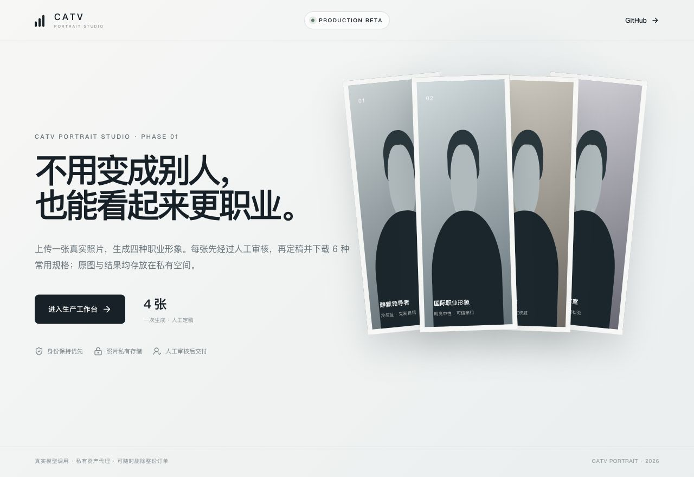
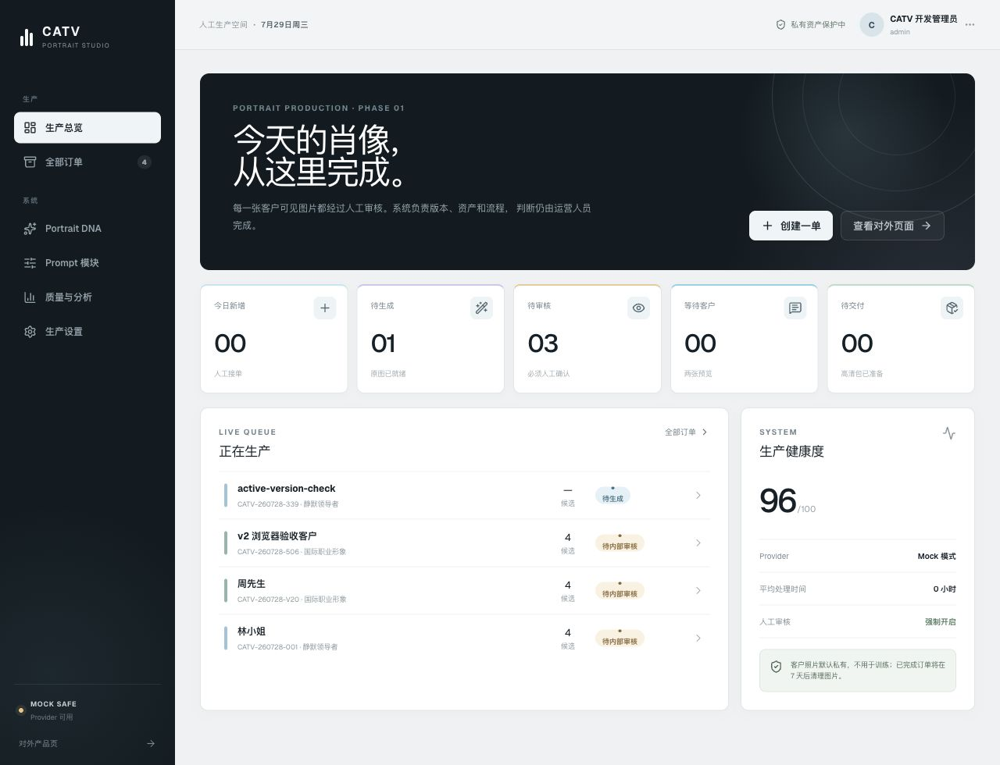
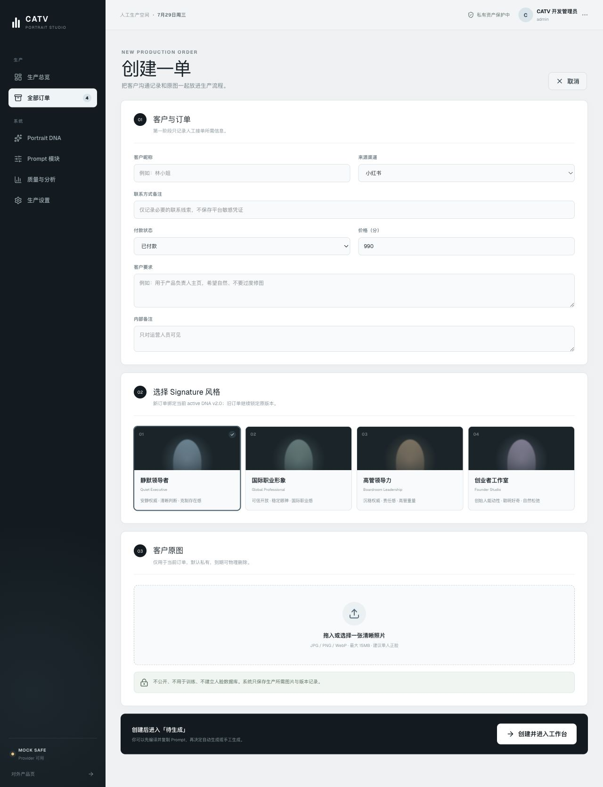
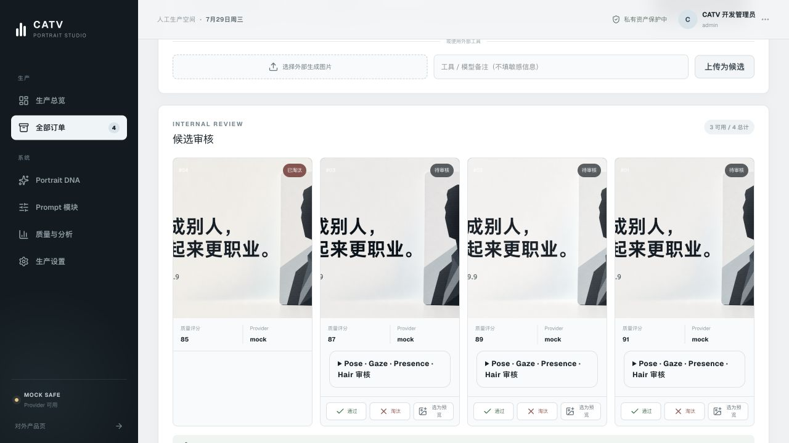
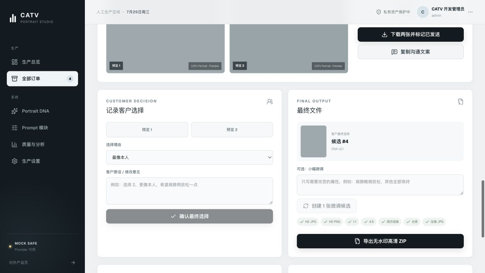
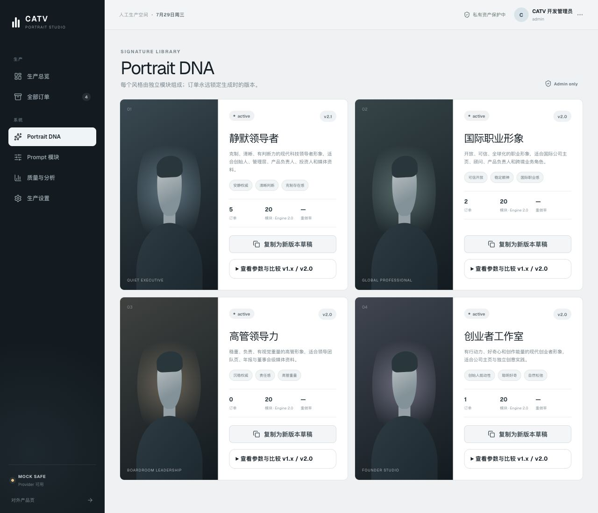
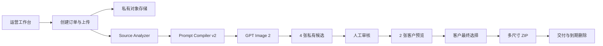

# CATV Portrait Studio

> 不用变成别人，也能看起来更职业。

CATV Portrait Studio 是一套面向运营团队的 AI 职业肖像生产系统。运营人员上传一张已获得授权的客户原图，系统使用 **CATV Portrait Engine v2.0** 编译结构化 Prompt，并通过 **GPT Image 2** 生成职业肖像候选；所有结果必须经过人工审核，才能进入客户预览、最终定稿和多尺寸交付。

[线上产品](https://portrait.catv.space) · [产品说明](./PROJECT_BRIEF.md) · [摄影标准](./docs/portrait-photography-standard-v2.md) · [运营手册](./docs/operations-manual.md)



> README 中的工作台截图来自本地 `Mock Safe` 环境，使用隐私安全的占位图片和测试订单，不包含真实客户肖像。生产环境的默认图像模型为 `gpt-image-2`。

## 这个产品解决什么问题

普通 AI 生图工具只负责“生成一张图”，但商业职业肖像还需要稳定的身份保持、可重复的风格、人工质量判断、客户确认、文件交付和隐私删除。

CATV Portrait Studio 把这些步骤放进同一条可追踪的生产流程：

```text
创建订单
→ 上传客户原图
→ 选择 Portrait DNA
→ 编译固定 20 模块 Prompt
→ GPT Image 2 生成 4 张候选
→ 人工审核 Pose / Gaze / Presence / Hair
→ 选择 2 张客户预览
→ 记录客户最终选择
→ 导出 6 种规格的无水印 ZIP
→ 到期物理删除人像资产
```

## 看图了解完整使用流程

### 1. 从生产总览开始

登录运营工作台后，可以看到今日新增、待生成、待审核、等待客户和待交付订单。生产健康度会同时显示 Provider 状态、平均处理时间和人工审核策略。



点击「创建一单」开始新的肖像生产任务；点击队列中的订单，可以继续之前未完成的工作。

### 2. 创建订单、选择风格并上传原图

填写必要的客户信息和使用场景，从四个 Portrait DNA 中选择一个方向，再上传一张清晰的单人照片。



当前内置四种职业肖像方向：

| Portrait DNA | 视觉目标 | 推荐场景 |
| --- | --- | --- |
| 从容领导力 | 安静权威、清晰判断、克制存在感 | 创始人、产品负责人、投资人 |
| 国际职业形象 | 可信开放、稳定眼神、国际职业感 | LinkedIn、顾问、跨境业务 |
| 高管领导力 | 沉稳权威、责任感、高管重量 | 管理团队、年报、媒体资料 |
| 创业者工作室 | 创始人能动性、聪明好奇、自然松弛 | 公司主页、创意实践、个人品牌 |

上传时系统会检查格式、大小、分辨率和图片可解码性。浏览器端会校正方向、压缩图片并去除 EXIF；原图默认存放在私有空间。

### 3. 生成四张候选并人工审核

系统先把身份保持、姿态、眼神、表情、存在感、头发、服装、构图、镜头、灯光、背景和输出规则编译为可追踪 Prompt，再调用图像模型生成四张候选。



每一张候选都要由运营人员检查：

- Identity：是否仍然是同一个人，年龄、脸型和五官有没有被改变。
- Pose：面部是否接近正面，肩膀、下巴和躯干角度是否自然。
- Gaze：眼神是否稳定、清晰，不过柔、不过凶、不怯弱。
- Presence：是否可信、有职业重量，同时避免戏剧化或攻击性。
- Hair & Grooming：发际线、长度和发色是否保持，发量是否自然。
- Artifacts：眼睛、牙齿、皮肤、头发、首饰、服装和背景是否存在生成错误。

自动质量分只提供辅助。候选必须人工点击「通过」或记录淘汰原因，系统不会绕过人工判断直接交付。

### 4. 发送两张预览并记录客户选择

从通过审核的候选中选择两张，系统生成带预览标识、长边 640px、已清除 EXIF 的 JPG。运营人员下载并发送给客户，再回到订单中记录客户选择和修改意见。

客户选择永远只能来自已经发送的预览，避免订单状态与实际沟通结果不一致。

### 5. 导出最终交付包

客户确认后，运营人员可以进行一次受控的小幅微调，或者直接导出最终无水印 ZIP。



交付包包含：

- 高清 JPG
- 高清 PNG
- 1:1 方形头像
- 4:5 职业主页版本
- 简历竖版
- 白底版本
- 压缩 JPG

系统保留订单、版本、审核和审计记录；客户人像资产则按照保留策略到期删除，也可以由管理员立即物理删除。

## Portrait DNA 与 Portrait Engine v2

Portrait DNA 不是一段不可追踪的自由 Prompt，而是一个具有版本号、状态和参数的职业肖像配方。新订单只绑定当前 `active` 版本，旧订单继续锁定生成时使用的版本。



Prompt Compiler v2 按固定顺序编译 20 个模块：

1. Identity
2. Source Interpretation
3. Pose Normalization
4. Gaze
5. Expression
6. Presence
7. Hair & Grooming
8. Career Identity
9. Wardrobe
10. Composition
11. Camera
12. Lens
13. Lighting
14. Background
15. Skin
16. Color
17. Retouch
18. Rendering
19. Output
20. Negative Rules

Identity 永远排在第一位，Negative Rules 永远排在最后一位。每次生成会记录 DNA 版本、Engine 版本、Compiler 版本、模块版本和 Prompt checksum，生成后不可静默修改。

## 核心能力

| 能力 | 当前实现 |
| --- | --- |
| 真实图像生成 | OpenAI Image Edit API，默认模型 `gpt-image-2` |
| 批量候选 | 每次生成 4 张，也支持单张补生成和外部图片导入 |
| 身份保护 | 原图只作为身份参考，不把自拍姿势和背景当模板 |
| 风格系统 | 4 个 Portrait DNA，支持 draft、testing、active、retired |
| Prompt 治理 | 固定 20 模块、版本锁定、checksum、Admin 可追踪 |
| 人工质检 | Pose、Gaze、Presence、Hair 以及常见伪影检查 |
| 客户预览 | 两张低分辨率水印预览，EXIF 清除 |
| 最终交付 | 多尺寸、无水印 ZIP |
| 私有存储 | Vercel Blob 或 Cloudflare R2，不向浏览器暴露真实存储路径 |
| 隐私删除 | 支持订单级物理删除和自动保留期限 |
| 审计 | 订单状态、生成、审核、客户选择、导出和删除均留有记录 |

## 系统架构



仓库包含两条可复用的运行路径：

- `app/` + `src/modules/portrait/`：完整 Vinext / Cloudflare D1 + R2 生产域，包含订单、DNA、Prompt、审核、分析、角色与审计。
- `demo/` + `api/` + `server/portrait-production/`：面向 Vercel 的轻量生产入口，使用私有 Blob 和 Serverless Functions。

关键目录：

```text
app/                              页面与 API 路由
demo/                             Vercel 轻量工作台
api/                              Vercel Functions
server/portrait-production/       Vercel 生成、存储、会话与交付逻辑
src/modules/portrait/
  analysis/                       原图技术分析
  database/                       D1 仓储与审计
  domain/                         订单、候选与 DNA 契约
  prompts/                        Prompt Compiler v2
  providers/                      Mock / OpenAI Image Provider
  quality/                        自动质量辅助
  ui/                             完整运营工作台
drizzle/                          数据库迁移
tests/                            单元、契约与 E2E 测试
docs/                             产品、引擎与运营文档
```

## 本地运行

要求：

- Node.js 22.13+
- pnpm 10+

```bash
pnpm install
cp .env.example .env.local
pnpm dev
```

打开：

- 运营后台：<http://localhost:3000/admin/portrait>
- 对外页面：<http://localhost:3000/portrait>

`.env.example` 默认使用安全的 Mock Provider，可以在不产生模型费用、不上传真实客户照片的情况下体验完整工作流。

## 启用 GPT Image 2

生产环境只在服务端配置密钥，不要创建 `VITE_OPENAI_API_KEY`，也不要把 API Key 提交到 Git。

完整工作台：

```dotenv
PORTRAIT_PROVIDER=openai
PORTRAIT_PROVIDER_API_KEY=
PORTRAIT_PROVIDER_BASE_URL=https://api.openai.com/v1
PORTRAIT_PROVIDER_MODEL=gpt-image-2
```

Vercel 轻量入口：

```dotenv
BLOB_READ_WRITE_TOKEN=
PORTRAIT_ACCESS_KEY=
OPENAI_API_KEY=
OPENAI_IMAGE_MODEL=gpt-image-2
```

模型请求通过服务端 `/v1/images/edits` 发出，使用客户原图作为身份参考，并输出适合职业肖像的竖版 JPEG。缺少 API Key 时，真实 Provider 会停止调用，不会静默降级为未知服务。

## 部署

Vercel 项目配置位于 [`vercel.json`](./vercel.json)：

```bash
vercel link
vercel env pull .env.local
vercel --prod
```

首次生产部署前需要：

1. 连接私有 Vercel Blob。
2. 配置至少 12 位的 `PORTRAIT_ACCESS_KEY`。
3. 配置服务端 `OPENAI_API_KEY`。
4. 确认 `OPENAI_IMAGE_MODEL=gpt-image-2`。
5. 使用一张已授权的测试照片跑通上传、四图生成、审核和 ZIP 下载。

Cloudflare / Vinext 路径的绑定和数据迁移由 [`vite.config.ts`](./vite.config.ts)、[`db/schema.ts`](./db/schema.ts) 与 [`drizzle/`](./drizzle/) 管理。

## 隐私与商业使用边界

- 只处理客户明确授权用于职业肖像制作的照片。
- 不建立人脸数据库，不保存人脸识别模板。
- 不从照片推断职业、性格、健康、种族或其他敏感属性。
- 不把客户照片用于训练。
- 原图、候选和最终文件默认私有，浏览器只获得受控代理或签名地址。
- 所有候选都必须人工检查身份相似度和生成伪影。
- “重新生成四张”会再次产生四次模型费用，界面会二次确认。
- 删除订单人像资产属于不可恢复操作，只保留必要订单和审计记录。

准备商用前，请根据服务地区补充隐私政策、客户授权文本、数据处理协议和退款/重做规则。

## 验证

```bash
pnpm typecheck
pnpm test
pnpm lint
pnpm build
pnpm build:demo
```

测试覆盖：

- Prompt 模块顺序、参数与版本 checksum
- Portrait DNA v1.x / v2.x 兼容
- Provider 成功、部分成功、超时和错误处理
- 订单状态机与人工审核
- 会话签名、同源校验和私有路径保护
- Vercel 生产入口与模型默认值

## 延伸文档

- [产品原则与范围](./PROJECT_BRIEF.md)
- [Portrait Engine v2](./docs/portrait-engine-v2.md)
- [Portrait DNA](./docs/portrait-dna.md)
- [Prompt Compiler](./docs/prompt-compiler.md)
- [摄影标准 v2](./docs/portrait-photography-standard-v2.md)
- [Pose Normalization Engine](./docs/pose-normalization-engine.md)
- [Gaze Engine](./docs/gaze-engine.md)
- [Presence Engine](./docs/presence-engine.md)
- [Hair & Grooming Engine](./docs/hair-grooming-engine.md)
- [Provider 集成](./docs/provider-integration.md)
- [运营手册](./docs/operations-manual.md)
- [后续路线图](./docs/phase-2-roadmap.md)

---

CATV Portrait Studio · Phase 01 · Portrait Engine v2.0
